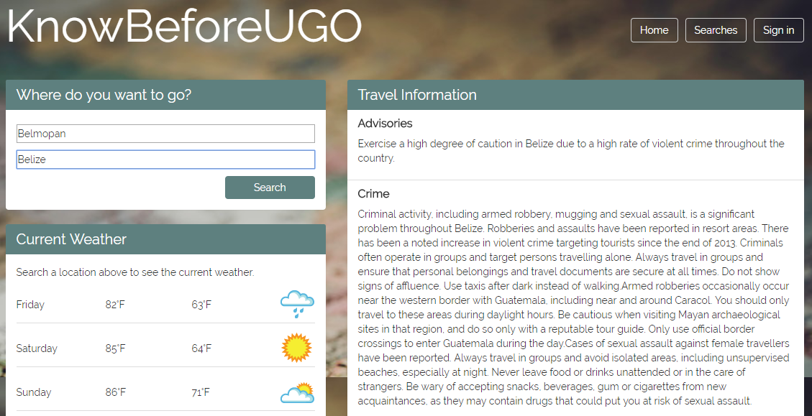

# KnowBeforeUGO

##### Travel safety and weather advisory app. Users enter their travel destinations using city/country names.



## The app utilizes the following API services:

* TuGO API: http://developer.tugo.com/
* Weather Underground: https://www.wunderground.com/weather/api/
* Google Maps Geocoding API: https://developers.google.com/maps/documentation/geocoding/start


## Technologies Used

* HTML/CSS/jQuery
* Node.js/Express
* Firebase


View on Heroku:
https://knowbeforeugo.herokuapp.com/


## Run the App Locally

First clone this repository:
```
https://github.com/emmapankey/KnowBeforeUGO.git
```

### Prerequisites:
#### Node.js and npm
Go to the Node.js site:  https://nodejs.org/en. Click the download button, and run through the installation file.
To check if you already have Node.js installed, run this command in your terminal:
```
node -v
```
To confirm that you have npm installed you can run this command in your terminal:
```
npm -v
```

### Installing Node Packages:
In the terminal execute the following command:
```
npm install
```
This will install all of the app's node module dependencies.

## Run

To run the application and connect to the Express server execute the following command in the server.js file:

```
node server.js
```

## Authors

* Emma Pankey (https://github.com/emmapankey)
* Tom Peralto (https://github.com/peraltot)
* Mike Sherman (https://github.com/msherman83)
* Lauren Wilson (https://github.com/laurmw6)
